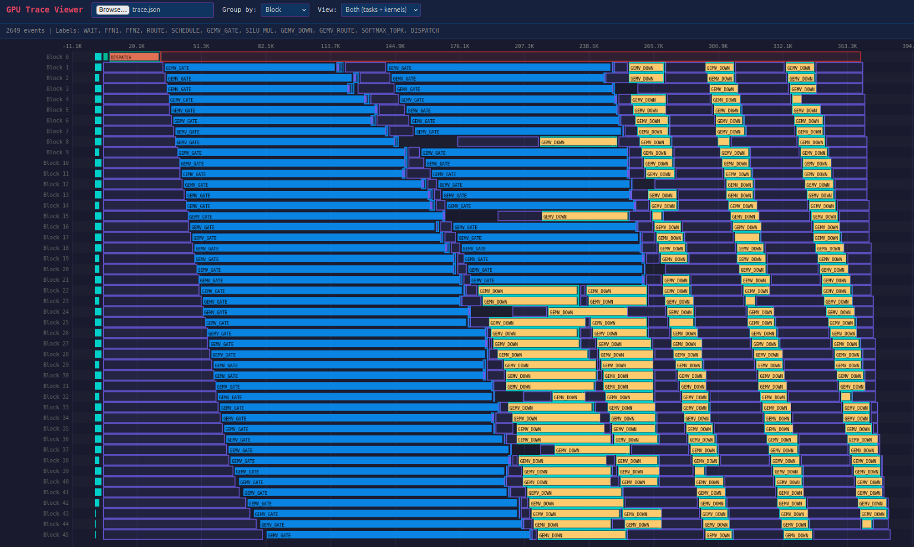
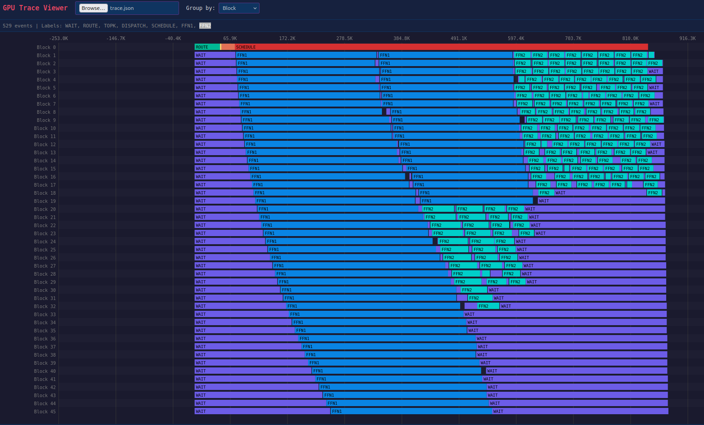
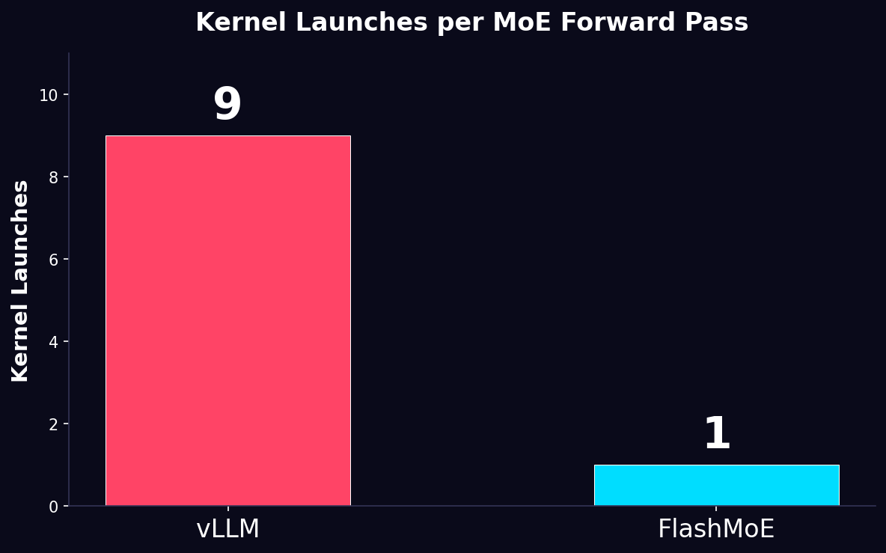

# FlashMoE

Single-kernel Mixture of Experts operator for NVIDIA GPUs, inspired by the [FlashDMoE paper](https://arxiv.org/abs/2506.04667) and [Flash-Moe, Piotr.k](https://github.com/makora-ai/flash-moe).

In this repository I recreated the paper FlashDMoE where the approach is an actor-based scheduling defining concrete roles to the SMs. This approach turned out to create a lot of scheduling problems for the kernel itself (most of them I tried to fix by leveraging some small tricks). The main problem with the current scheduling I have is that a single thread from a warp is dedicated to sending tasks to the Worker blocks.
Turns out there are a lot of waits (per my tracer tool used).
This approach is an experimental one that will benefit from a multi-GPU setup where the latency of the GPU communication is the bottleneck.
A better approach (without experimenting yet) would be separate kernels.


Tricks used and learnings

Kernel wise:
- Topk first then softmax -> not doing  softmax and then topk when we need to softmax just for number stability :D
- Fused gate and up for the FFN
- Prefetch + ILP for the GEMV. Shared memory was useless
- Thinking the operation and testing micro benchmarks to get a better feeling of problems

Bigger picture:
- Thinking of ways to analyze the problem from a different perspective where the kernel is a small part and the bigger system is the task one (opening doors and horizons to task-based DLC)
- Analyzing problem computation to optimize it.
- Understanding why better hardware mapping is important (my current approach was not efficient from this perspective)


## Scheduling Traces

### Current approach
Uses a `next_w` round-robin to find the next ready worker SM and check its status before assigning work. This avoids the bottleneck of a single thread dispatching all tasks sequentially, and distributes scheduling load more evenly across workers. We also spread the initial routing across SMs. However, we still see big bubbles in the GEMV_DOWN phase.



### Other approaches

1. Simple queue. A single thread handles all task dispatch sequentially. Most worker SMs end up waiting idle.



2. Multiple scheduling warps. Uses more scheduling-related warps to reduce the dispatch bottleneck.


Targets **single-token decode** through one MoE layer (Qwen3-30B-A3B config) on RTX 4070.

## Architecture

A persistent kernel with an embedded OS:

- OS block (1 SM) scheduler (assigns tasks to workers via doorbells)
- Worker blocks (45 SMs) poll doorbells, execute FFN tiles, push follow-up tasks on fan-in completion

```
Bootstrap → push FFN1 tiles → Scheduler → doorbells → Workers
                                    ↑                      │
                                    └── FFN2 tiles ←───────┘
```

## Config

Hardcoded in `csrc/flashmoe.cuh` to match Qwen3-30B-A3B:

| Parameter | Value |
|-----------|-------|
| HIDDEN_SIZE | 2048 |
| MOE_INTERMEDIATE_SIZE | 768 |
| NUM_EXPERTS | 128 |
| TOP_K | 8 |
| Activation | SiLU (SwiGLU) |

## Benchmark

RTX 4070 Laptop GPU, Qwen3-30B-A3B config, T=1, fp16, 200 iterations, 50 warmup.

| Condition | GPU Clock | vLLM (ms) | FlashMoE (ms) | Speedup |
|-----------|-----------|-----------|---------------|---------|
| Locked clock | 2700 MHz | 0.348 | 0.413 | 0.84x |
| Battery (unlocked) | ~3100 MHz boost | 0.628 | 0.493 | 1.27x |
| Charger (unlocked) | throttled | 0.342 | 0.413 | 0.83x |

The honest result at locked clocks is **0.84x**.

### Kernel launches: 1 vs 9

vLLM needs 9 separate kernel launches per MoE forward pass (topkGating, moe_align_block_size, count_and_sort, gemvx, 2x fused_moe_kernel, act_and_mul, reduce, memcpy). FlashMoE does it in 1.



### Benchmarking learnings

- Battery vs charger gives different results because the charger triggers SW Thermal Slowdown and SW Power Capping, throttling the GPU differently for each kernel.
- Unlocked clocks are unreliable. Whichever kernel runs first gets the higher boost, the second runs on a warmer GPU.
- Lock the GPU clock (`nvidia-smi -lgc 2700,2700`) for reproducible results. Picked 2700 MHz because 3105 max is not thermally sustainable on a laptop.
- More warmup (50 instead of 10) to reach thermal steady state before measuring.
- Separate state per benchmark. Fixed a shared input counter bug and added `torch.cuda.empty_cache()` between runs.